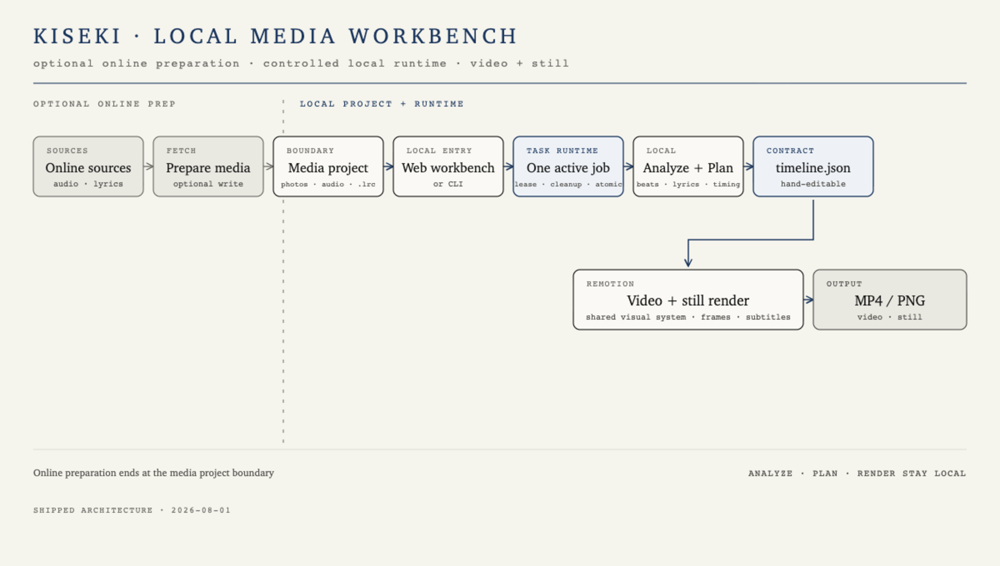

# kiseki (軌跡)

> Photos + a song (+ optional lyrics) become a beat-synced visual diary. The local workbench manages material, makes video or stills, and shows results; analysis and rendering stay on your machine, while online preparation is optional.

[中文](README.md) · **English**

## Quick start

Requires [Node.js 18+](https://nodejs.org/), [uv](https://docs.astral.sh/uv/), and [FFmpeg](https://ffmpeg.org/).

```bash
npm --prefix cli install
npm --prefix renderer install
node cli/kiseki.mjs doctor
node cli/kiseki.mjs ./osaka-trip
```

A media folder contains photos, exactly one audio file, and an optional `.lrc`. Audio and lyrics may be at the root or in `audio/`. Without an `.lrc`, kiseki may download the required model on first use and recognize lyrics locally.

## Usage

```bash
node cli/kiseki.mjs
node cli/kiseki.mjs ./osaka-trip
node cli/kiseki.mjs ./osaka-trip -o out.mp4
node cli/kiseki.mjs lyrics ./osaka-trip
node cli/kiseki.mjs fetch ./osaka-trip
node cli/kiseki.mjs still ./photo.jpg
node cli/kiseki.mjs doctor
node cli/kiseki.mjs web ./osaka-trip
node cli/kiseki.mjs help
```

Without arguments, kiseki opens a persistent interactive menu; each flow returns after completion, cancellation, or failure, and `q` exits. Commands with arguments run once. `<folder>` makes a video, `lyrics` only previews lyrics, `fetch` interactively prepares online audio or lyrics, `still` exports PNGs, `doctor` checks dependencies, and `web [folder]` starts the local workbench; `help` is the complete syntax reference.

The default video is `osaka-trip/output/osaka-trip.mp4`; stills default to `output/stills/`. When `-o` is omitted, EXIF, signature, dark mode, aspect, draft, and an effective filter are appended to the default filename. An explicit `-o` path takes precedence unchanged.

Build the web frontend before its first use: `npm --prefix web install && npm --prefix web run build`. The page can view and make material, and rename or delete assets. Writes are protected by the startup material root, server token, conflict and job checks; deletion first moves an item to trash and undo is available only within the running process. See [project status](docs/kiseki-status.md).

## Architecture

The local workbench and CLI share one controlled task runtime; optional online preparation stops at the media project boundary, while analysis and rendering stay local.



## Configuration and documentation

- [Configuration reference](docs/config.md): the strict 21-key `kiseki.toml` contract
- [Timeline format](docs/specs/timeline-schema.md): read-only validation boundaries for `timeline.json`
- [Project status](docs/kiseki-status.md): workbench, cache, and known limits

## Development

```bash
cd analyzer && uv run pytest
cd cli && npm test
cd renderer && npm run typecheck
cd renderer && npm run studio
```

## License

Code is licensed under [MIT](LICENSE); bundled Noto fonts are under [SIL OFL 1.1](renderer/src/fonts/OFL.txt).
