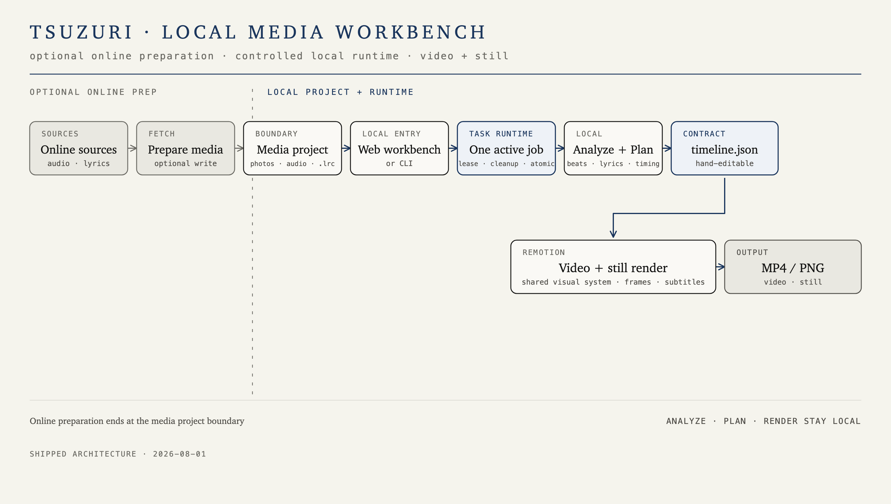

# kiseki（軌跡）

> 照片，配上一首歌或直接无声，做成一支影像日记。本地工作台可整理素材、制作视频或静态图并查看成果；音频分析与渲染在本机完成。从 YouTube 获取音频、在线查找歌词，以及用户显式开启的图片旁白，是可选的在线步骤。

**中文** · [English](README.en.md)

## 快速开始

先安装一次 [Node.js 18+](https://nodejs.org/)。然后双击仓库里的 `启动.command`（macOS）或 `启动.bat`（Windows），浏览器会打开本地工作台。

缺 uv 或 FFmpeg 时，点页面上的环境按钮，选择对应的「安装」。macOS 安装 FFmpeg 需要本机已有 Homebrew；Windows 使用 winget。装好后点「重新检查」，不用重启。

不需要手改 `kiseki.toml`。常用选项都在制作页里，文件配置只留给想固定偏好的人。

安装包和网页用的是同一套界面与任务代码。macOS 与 Windows 各自打包：在对应系统上先执行 `npm --prefix web run build`，再执行 `npm --prefix desktop install` 和 `npm --prefix desktop run build`。安装包只带打开界面需要的 Node 和渲染器。第一次打开后，在「准备这台电脑」里点下载 FFmpeg 和分析组件。这些下载优先走国内镜像，存到这台电脑的应用数据里。本机已经安装 Chrome、Chromium 或 Edge 时，出片直接用它；否则第一次做视频仍会下载渲染用的浏览器，那个地址在国内可能连不上。没有歌词文件、需要识别时才下载识别模型，优先走国内镜像。从 YouTube 获取音频和在线查找歌词依赖对应网站，连不上时会说明是网络原因，可以把歌或 `.lrc` 放进素材夹。

开发者仍可用：

```bash
./scripts/setup.sh
node cli/kiseki.mjs doctor
node cli/kiseki.mjs ./osaka-trip
```

素材夹包含照片，以及可选的一首歌和可选 `.lrc`；音频和歌词可放在根目录或 `audio/`。没有歌时，照片会按每张 4 秒做成无声视频。没有 `.lrc` 时，首次识别可能下载所需模型并在本地识别歌词。

在线歌词搜索支持 LRCLIB 与 AMLL TTML DB。选择歌曲后可逐句预览原文与已有中文译文，保存时一起写入一份 `.lrc`，不进行机器翻译。来源暂时不可用时会提示，其他来源继续可用。含中文译文时默认双语显示，制作页可以切换为原文或不显示；CLI 使用 `--lyrics-mode original|none`。切换不重新下载，原文版默认文件名带 `-lyrics-original`，不显示歌词时带 `-lyrics-none`。AMLL 的歌曲覆盖和译文完整程度取决于社区词库，下载预览保留来源与贡献者信息。[AMLL 歌词库](https://github.com/amll-dev/amll-ttml-db)

## 使用

```bash
node cli/kiseki.mjs
node cli/kiseki.mjs ./osaka-trip
node cli/kiseki.mjs ./osaka-trip -o out.mp4
node cli/kiseki.mjs lyrics ./osaka-trip
node cli/kiseki.mjs fetch ./osaka-trip
node cli/kiseki.mjs still ./photo.jpg
node cli/kiseki.mjs doctor
node cli/kiseki.mjs templates
node cli/kiseki.mjs web ./osaka-trip
node cli/kiseki.mjs help
```

不带参数会打开常驻交互菜单；每个流程完成、取消或报错后回到菜单，输入 `q` 退出。带参数的命令执行一次后退出。`<folder>` 制作视频，`lyrics` 只预览歌词，`fetch` 交互补齐在线音频或歌词，`still` 导出 PNG，`doctor` 检查依赖，`templates` 列出呈现模板，`web [folder]` 启动本地工作台；完整语法以 `help` 为准。视频可用 `--template <id>` 选呈现模板（转场/字幕/章节卡的"长相"），`templates` 可查看可用模板；滤镜、暗色等素材基调选项与模板互相独立。

默认视频为 `osaka-trip/output/osaka-trip.mp4`，静态图默认位于 `output/stills/`。未使用 `-o` 时，EXIF、签名、图片旁白、暗色、画幅、草稿、模板和实际生效的滤镜会按此顺序追加到默认文件名；显式 `-o` 保持原样优先。

可选图片旁白：

```bash
DEEPSEEK_API_KEY=... node cli/kiseki.mjs ./osaka-trip --photo-caption
DEEPSEEK_API_KEY=... node cli/kiseki.mjs still ./photo.jpg --photo-caption
```

制作页上，签名在片尾文字前面。片尾白场默认是 `Thanks for watching :)`，留空则不显示。输入名字会生成片头手写签名，这次成片会用它。勾选「签名落款」时，照片上的落款也用这份签名。导出静态图时，同一个名字会画成签名落款。这些都不改素材夹里的 `kiseki.toml`。

图片旁白的密钥在工作台的环境面板里填写，保存后立刻生效，不用改文件，也不用重启。密钥写入仓库根目录的 `.env`（已被忽略，不进入 git），页面之后只显示「已配置」。已在终端里 export 的 `DEEPSEEK_API_KEY` 仍优先生效。开启后会把缩小后的 JPEG 预览发给 DeepSeek，文案缓存在 `output/metadata/ai-captions.json`，全部生成后再开始渲染；原图不会上传。关闭该选项时路径与现有本地分析/渲染一致。

`web` 启动本地工作台，前端由 `./scripts/setup.sh` 构建。网页可查看和制作素材，也可改名或删除资产；写入受启动时的素材根目录、服务 token、冲突与任务检查保护，删除先移入回收区并仅提供进程内撤销。详见[项目状态](docs/kiseki-status.md)。

## 架构

本地工作台和 CLI 共享受控任务运行时；fetch 把在线音频/歌词写入素材夹，图片旁白是 plan 之后的可选在线准备并写入 `output/metadata/`，音频/时间线分析与渲染始终在本机完成。



## 配置与文档

- [配置参考](docs/config.md)：严格的 `kiseki.toml` 22 键契约
- [时间线格式](docs/specs/timeline-schema.md)：`timeline.json` 的只读校验边界
- [项目状态](docs/kiseki-status.md)：工作台、缓存与已知限制

`docs/plans/` 是历史实施笔记；现行说明以配置、时间线和项目状态为准。

## 开发

```bash
cd analyzer && uv run pytest
cd cli && npm test
cd renderer && npm run typecheck
cd renderer && npm run studio
```

## 许可

代码采用 [MIT](LICENSE) 许可；内置 Noto 字体采用 [SIL OFL 1.1](renderer/src/fonts/OFL.txt)。
